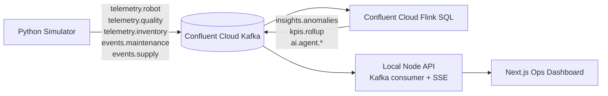

# Autonomous Manufacturing Intelligence Platform

Local production-grade architecture that streams simulated manufacturing telemetry into Confluent Cloud Kafka, processes it with Confluent Cloud Flink SQL, and serves real-time insights to a Next.js dashboard via a local Node API.

## Architecture



## Setup

1. Create Confluent Cloud cluster + API key/secret and Schema Registry credentials.
2. Copy `.env.example` to `.env` and fill in your Confluent Cloud credentials.
3. Create the Kafka topics:
   - `telemetry.robot`
   - `telemetry.quality`
   - `telemetry.inventory`
   - `events.maintenance`
   - `events.supply`
   - `insights.anomalies`
   - `kpis.rollup`
   - `alerts.acks`
4. In Confluent Cloud Flink SQL workspace:
   - Run `flink/create_tables.sql`
   - Run `flink/pipeline.sql`
5. Create additional AI agent topics:
   - `ai.agent.machine_health`
   - `ai.agent.quality`
   - `ai.agent.supply`
   - `ai.agent.decisions`

## Local Run

```bash
npm install
```

```bash
npm run dev:api
npm run dev:web
npm run dev:sim
```

The UI reads from `http://localhost:4000` by default (configure `NEXT_PUBLIC_API_BASE` in `.env`).

## Notes

- If you want to run the UI without Kafka, set `KAFKA_DISABLED=true` in `.env` for the API to emit mock data.
- Schemas live in `schemas/` for topic contract governance.
- AI agent outputs are published to `ai.agent.*` topics by Flink AI/Streaming Agents.
