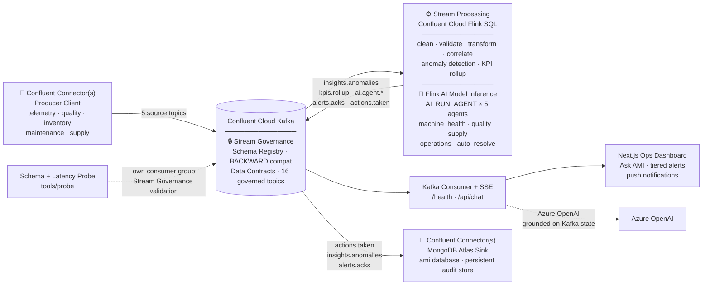

# Autonomous Manufacturing Intelligence Platform

Production-grade architecture that streams manufacturing telemetry into Confluent Cloud Kafka, processes it with Confluent Cloud Flink SQL, and serves real-time insights and autonomous actions to a Next.js dashboard. **Signal in, decisive action out** — with governed contracts, multi-agent AI reasoning, and a closed autonomous loop built directly into the streaming layer.

## Architecture



## What Makes It Memorable

- **Live data, not batch guesses** — Every KPI and anomaly is computed continuously in Flink SQL.
- **Contracts first** — Every topic has a JSON schema registered in Schema Registry with BACKWARD compatibility. Producers and consumers are always aligned.
- **5-agent multi-agent pipeline in Flink** — One anomaly fans out to 5 `AI_RUN_AGENT` statements, each writing to its own governed topic. Kafka topics are the message bus between agents; Flink is the runtime.
- **Autonomous resolution loop** — The 5th agent (`auto_resolve_agent`) reads LOW/MEDIUM anomalies, calls AI to decide DECISION: YES/NO, and writes resolutions directly to `alerts.acks` — no human click required. Every decision is audited in `actions.taken`.
- **Tiered autonomy** — Routine anomalies are auto-resolved by the Flink agent; CRITICAL/HIGH escalate to human approval on the dashboard. Both paths close the loop back into Kafka.
- **Ask AMI chatbot** — Natural-language assistant grounded strictly on live Confluent state. Answers from what's flowing through Kafka right now; refuses to invent readings.
- **Push notifications + in-page banners** — CRITICAL and HIGH alerts fire OS-level browser notifications and a dismissing in-page banner, without any external service.
- **Built-in observability** — `/health` reports Kafka connection state, per-topic message count, staleness, and produce→consume lag.
- **Schema + latency probe** — `tools/probe` validates every live message against `schemas/` and measures p95 latency per topic.
- **MongoDB Atlas Sink Connector** — A managed Confluent connector continuously sinks `actions.taken`, `insights.anomalies`, and `alerts.acks` into MongoDB Atlas (`ami` database). Every AI decision, anomaly, and acknowledgment is permanently stored and queryable — Kafka retention is time-bounded; MongoDB is the persistent audit store.

## Kafka Topics

| Topic | Direction | Purpose |
|---|---|---|
| `telemetry.robot` | Source | Per-machine vibration, torque, temp, defect rate |
| `telemetry.quality` | Source | Per-line defect rate per batch |
| `telemetry.inventory` | Source | Part stock levels and consumption |
| `events.maintenance` | Source | Maintenance actions and technician |
| `events.supply` | Source | Supplier delay events |
| `insights.anomalies` | Flink sink | Detected anomalies with severity + agent hints |
| `kpis.rollup` | Flink sink | Live KPI snapshot (downtime risk, throughput, etc.) |
| `ai.agent.machine_health` | Flink sink | Machine health agent output |
| `ai.agent.quality` | Flink sink | Quality agent output |
| `ai.agent.supply` | Flink sink | Supply chain agent output |
| `ai.agent.decisions` | Flink sink | Operations coordinator agent output |
| `alerts.acks` | Sink (human + Flink) | Acknowledgments — operator or `ami-flink` |
| `actions.taken` | Flink sink | Audit log of every autonomous AI decision |
| `alerts.escalated` | Flink sink | Anomalies the AI escalated to human review |

## Persistence — MongoDB Atlas

A **managed Confluent MongoDB Atlas Sink Connector** continuously writes three topics into MongoDB Atlas (database: `ami`):

| Kafka Topic | MongoDB Collection | What's stored |
|---|---|---|
| `actions.taken` | `actions.taken` | Every autonomous AI decision — YES/NO + full reasoning |
| `insights.anomalies` | `insights.anomalies` | Complete anomaly history with severity + agent hints |
| `alerts.acks` | `alerts.acks` | Full acknowledgment audit trail — human and AI-generated |

Kafka topics have retention limits; MongoDB Atlas is the **permanent, queryable audit store**. This satisfies the "Use of Confluent Connector(s)" prize requirement with a real managed sink.

## Setup

1. Create Confluent Cloud cluster (Azure East US) + API key/secret and Schema Registry credentials.
2. Copy `.env.example` to `.env` and fill in credentials. For Ask AMI, also set: `AZURE_OPENAI_ENDPOINT`, `AZURE_OPENAI_AI_KEY`, `AZURE_OPENAI_DEPLOYMENT`, `AZURE_OPENAI_API_VERSION`.
3. Create all Kafka topics listed above.
4. Register all JSON schemas from `schemas/` in Schema Registry.
5. In Confluent Cloud Flink SQL workspace:
   - Run `flink/create_tables.sql`
   - Run `flink/pipeline.sql`
6. Register all 5 agents in the Confluent AI model registry: `machine_health_agent`, `quality_agent`, `supply_agent`, `operations_agent`, `auto_resolve_agent`.
7. Create MongoDB Atlas cluster on **Azure East US** (must match Confluent cluster region).
8. In Confluent Cloud → Connectors → add **MongoDB Atlas Sink**:
   - Topics: `actions.taken`, `insights.anomalies`, `alerts.acks`
   - Host: your Atlas cluster hostname
   - Database: `ami`
   - Format: `JSON`

## Local Run

```bash
npm install
npm run dev:api
npm run dev:web
npm run dev:sim
```

## API Endpoints

| Method | Path | Purpose |
|--------|------|---------|
| `GET`  | `/api/stream` | SSE stream — live KPIs, anomalies, machines, agents |
| `GET`  | `/api/kpis` | One-shot state snapshot |
| `GET`  | `/health` | Kafka connection, uptime, per-topic lag + staleness |
| `POST` | `/api/chat` | Ask AMI: `{ question, history? }` → grounded answer |
| `POST` | `/api/ack` | Human acknowledge — produces to `alerts.acks` |

## Ask AMI

```bash
curl -X POST http://localhost:4000/api/chat \
  -H "Content-Type: application/json" \
  -d '{"question":"which machine is at highest risk right now?"}'
```

## Schema + Latency Probe

```bash
npm run probe -- --seconds=30 --threshold=3000
```

Reports schema conformance, per-topic p95 latency, and field-map cross-check. Exit `0` = pass, `1` = failure, `3` = no messages.

## Notes

- The chatbot calls Azure OpenAI from the API. Confluent's Real-Time Context Engine + MCP requires an AWS cluster (unavailable on this Azure cluster); the same UI can swap to in-Flink `AI_COMPLETE` if the cluster migrates.
- `auto_resolve_agent` system prompt instructs DECISION: YES/NO + one sentence reasoning. Only LOW/MEDIUM anomalies are eligible for autonomous resolution; CRITICAL/HIGH always require human approval.
