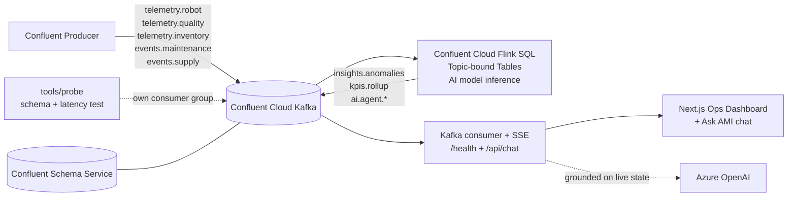

# Autonomous Manufacturing Intelligence Platform

Production-grade architecture that streams simulated manufacturing telemetry into Confluent Cloud Kafka, processes it with Confluent Cloud Flink SQL, and serves real-time insights to a Next.js dashboard via API wich consumes data from Kafka. Think **signal in, insight out** - with governed contracts, real-time transformations, and AI-assisted reasoning built directly into the streaming layer.

## Architecture



## What Makes It Memorable

- **Live data, not batch guesses**: Every KPI and anomaly is computed continuously in Flink SQL (see `flink/pipeline.sql`).
- **Contracts first**: Each topic has an explicit JSON schema under `schemas/`, registered in Schema Registry, keeping producers and consumers aligned.
- **Streaming in, streaming out**: Flink SQL tables bind topics to sources and sinks (see `flink/create_tables.sql`).
- **AI in the flow**: The pipeline calls `AI_RUN_AGENT(...)` to generate machine-health, quality, supply, and decision insights into `ai.agent.*` topics.
- **Ask AMI chatbot**: A natural-language assistant grounded **only on live Confluent state** — it reads the API's materialized Kafka data (never the simulator) and answers via Azure OpenAI. Reach it from the **"Ask AMI"** button in the dashboard top bar.
- **Built-in observability**: A `/health` endpoint reports Kafka connection state plus per-topic message counts, staleness, and produce→consume lag.
- **Schema + latency test harness**: `tools/probe` connects as its own consumer group, validates every live message against `schemas/`, and measures per-topic latency — so you can prove the pipeline is correct and quantify any lag.

## Setup

1. Create Confluent Cloud cluster + API key/secret and schema service credentials.
2. Copy `.env.example` to `.env` and fill in your Confluent Cloud credentials. For the **Ask AMI** chatbot, also set the Azure OpenAI vars: `AZURE_OPENAI_ENDPOINT`, `AZURE_OPENAI_AI_KEY`, `AZURE_OPENAI_DEPLOYMENT`, `AZURE_OPENAI_API_VERSION`.
3. Create the Kafka topics:
   - `telemetry.robot`
   - `telemetry.quality`
   - `telemetry.inventory`
   - `events.maintenance`
   - `events.supply`
   - `insights.anomalies`
   - `kpis.rollup`
   - `alerts.acks`
4. In Confluent Cloud Flink SQL workspace:
   - Run `flink/create_tables.sql`
   - Run `flink/pipeline.sql`
5. Create additional AI agent topics:
   - `ai.agent.machine_health`
   - `ai.agent.quality`
   - `ai.agent.supply`
   - `ai.agent.decisions`

## Local Run

```bash
npm install
```

```bash
npm run dev:api
npm run dev:web
npm run dev:sim
```

## API endpoints

| Method | Path | Purpose |
|--------|------|---------|
| `GET`  | `/api/stream` | Server-Sent Events stream of live KPIs, anomalies, machines, agents |
| `GET`  | `/api/kpis` | One-shot snapshot of current state |
| `GET`  | `/health` | Kafka connection state, uptime, SSE client count, and per-topic `{ count, lastReceivedAgoMs, lastLagMs, stale }` |
| `POST` | `/api/chat` | Ask AMI: `{ question, history? }` → grounded answer from live Confluent state via Azure OpenAI |
| `POST` | `/api/ack` | Acknowledge an alert (produces to `alerts.acks`) |

## Ask AMI chatbot

A natural-language assistant for the live factory. It is **grounded only on Confluent
data**: the API already materializes every topic into in-memory state, and the chatbot
reads from that state — never from the simulator — so it behaves identically when real
sensors replace the simulator. The LLM call (Azure OpenAI) runs in the API; the system
prompt enforces "answer only from the provided state, never invent readings."

Open it from the **"Ask AMI"** button in the dashboard top bar, or call it directly:

```bash
curl -X POST http://localhost:4000/api/chat \
  -H "Content-Type: application/json" \
  -d '{"question":"which machine is at highest risk right now?"}'
```

## Schema + latency test harness (`tools/probe`)

An on-demand probe that connects as its own throwaway Kafka consumer group (never
disturbs the API's offsets), captures live messages, and reports:

1. **Schema conformance** — every payload validated against `schemas/*.json`
2. **Produce→consume latency** — per-topic min / avg / p95 / max lag
3. **Field-map cross-check** — keys the simulator emits vs. keys the API consumes

```bash
# simulator must be running so there are live messages to capture
npm run probe -- --seconds=30 --threshold=3000   # add --all to include Flink/AI output topics
```

Exit codes: `0` pass, `1` schema mismatch or latency over threshold, `3` no messages captured.

## Notes

- Schemas live in `schemas/` for topic contract governance (all topics registered in Schema Registry).
- AI agent outputs are published to `ai.agent.*` topics by Flink AI/Streaming Agents (`AI_RUN_AGENT`).
- The chatbot uses Azure OpenAI from the API ("fastest fallback"). Confluent's managed Real-Time Context Engine + MCP requires an AWS cluster and is unavailable on Azure; the same UI/transport can later swap to in-Flink `AI_COMPLETE` if the cluster moves to AWS.
