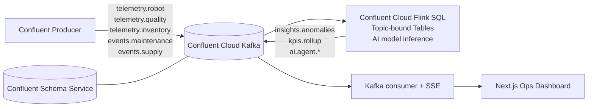

# Autonomous Manufacturing Intelligence Platform

Production-grade architecture that streams simulated manufacturing telemetry into Confluent Cloud Kafka, processes it with Confluent Cloud Flink SQL, and serves real-time insights to a Next.js dashboard via API wich consumes data from Kafka. Think **signal in, insight out** - with governed contracts, real-time transformations, and AI-assisted reasoning built directly into the streaming layer.

## Architecture



## What Makes It Memorable

- **Live data, not batch guesses**: Every KPI and anomaly is computed continuously in Flink SQL (see `flink/pipeline.sql`).
- **Contracts first**: Each topic has an explicit JSON schema under `schemas/`, keeping producers and consumers aligned.
- **Streaming in, streaming out**: Flink SQL tables bind topics to sources and sinks (see `flink/create_tables.sql`).
- **AI in the flow**: The pipeline calls `AI_RUN_AGENT(...)` to generate machine-health, quality, supply, and decision insights into `ai.agent.*` topics.

## Setup

1. Create Confluent Cloud cluster + API key/secret and schema service credentials.
2. Copy `.env.example` to `.env` and fill in your Confluent Cloud credentials.
3. Create the Kafka topics:
   - `telemetry.robot`
   - `telemetry.quality`
   - `telemetry.inventory`
   - `events.maintenance`
   - `events.supply`
   - `insights.anomalies`
   - `kpis.rollup`
   - `alerts.acks`
4. In Confluent Cloud Flink SQL workspace:
   - Run `flink/create_tables.sql`
   - Run `flink/pipeline.sql`
5. Create additional AI agent topics:
   - `ai.agent.machine_health`
   - `ai.agent.quality`
   - `ai.agent.supply`
   - `ai.agent.decisions`

## Local Run

```bash
npm install
```

```bash
npm run dev:api
npm run dev:web
npm run dev:sim
```


## Notes

- Schemas live in `schemas/` for topic contract governance.
- AI agent outputs are published to `ai.agent.*` topics by Flink AI/Streaming Agents (`AI_RUN_AGENT`).
